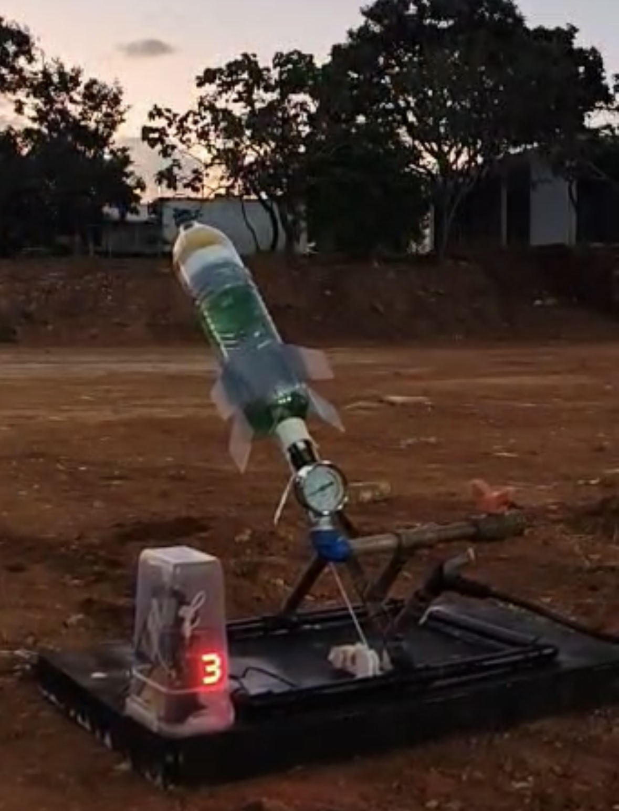

  <a href="https://www.youtube.com/shorts/Mo0wMRmowhE" target="_blank">
    <!-- use a custom image if você tiver -->
    
  </a>

<h1 align="center">🚀 Foguete d'Água com Base Automatizada 🚀</h1>

  Projeto Interdisciplinar - Faculdade UnB Gama 
  <strong>Engenharias Aeroespacial, Eletrônica, Software, Automotiva e Energia</strong> – 2025 
  <em>Controle de Trajetória, Automação e Análise de Dados</em>

---

## 📘 Sobre o Projeto

Este repositório contém o projeto **"Foguete d’Água com Base Automatizada"**, desenvolvido como parte da disciplina **Projeto Integrador de Engenharia 1 (PI1)** da Universidade de Brasília (UnB). O sistema foi concebido para realizar lançamentos de foguetes com **propulsão hidrostática** de forma segura, reutilizável e com **coleta de dados embarcada**.

> 🎯 **Objetivo**: Alcançar distâncias pré-definidas de 10 m, 20 m e 30 m com precisão de ±0.5 m, coletando e processando dados em tempo real por meio de um microcontrolador embarcado (ESP32). Após o voo, construir análises da trajetória.

---

## EQUIPE DO PROJETO

  <h3>TIME DE HARDWARE</h3>
  <table>
    <tr>
      <td align="center">
      <a href="https://github.com/vitorfleonardo">
        
         
        <b>Vitor Feijó</b>
         
        <small>Gerente do Projeto</small>
      </a>
    </td>
    <td align="center">
      <a href="https://github.com/vitorfleonardo">
        
         
        <b>Luis Lima</b>
         
        <small>Gerente de Hardware</small>
      </a>
    </td>
    <td align="center">
      <a href="https://github.com/bottinolucas">
        
         
        <b>Lucas Bottino</b>
         
        <small>Engenheiro de Hardware</small>
      </a>
    </td>
    <td align="center">
      <a href="https://github.com/R-enanVieira">
        
         
        <b>Renan Vieira</b>
         
        <small>Engenheiro de Hardware</small>
      </a>
    </td>
    </tr>
  </table>

  <h3>TIME DE SOFTWARE</h3>
  <table>
    <tr>
      <td align="center">
        <a href="https://github.com/melohugo">
          
           
          <b>Hugo Melo</b>
           
          <small>Gerente de Software</small>
        </a>
      </td> 
      <td align="center">
        <a href="https://github.com/BeyondMagic">
          
           
          <b>João V. Farias</b>
           
          <small>Engenheiro de Software</small>
        </a>
      </td> 
      <td align="center">
        <a href="https://github.com/LuizaMaluf">
          
           
          <b>Luiza Maluf</b>
           
          <small>Engenheira de Software</small>
        </a>
      </td>
      <td align="center">
        <a href="https://github.com/Nanashii76">
          
           
          <b>Paulo H. Lamounier</b>
           
          <small>Engenheiro de Software</small>
        </a>
      </td>
      <td align="center">
        <a href="https://github.com/MillenaQueiroz">
          
           
          <b>Millena Queiroz</b>
           
          <small>Engenheira de Software</small>
        </a>
      </td>
    </tr>
  </table>

   <h3>TIME DE ESTRUTURAS</h3>
   <table>
    <tr>
      <td align="center">
        
         
        <b>Ives Monteiro</b>
         
        <small>Gerente do Estruturas</small>
      </td>
      <td align="center">
          
           
          <b>Sophia Cordeiro</b>
           
          <small>Engenheira do Estruturas</small>
      </td>
      <td align="center">
          
           
          <b>Guilherme Carmona</b>
           
          <small>Engenheiro do Estruturas</small>
      </td>
      <td align="center">
          
           
          <b>Erik Moreira</b>
           
          <small>Engenheiro do Estruturas</small>
      </td>
      <td align="center">
          
           
          <b>Kaed Canizo</b>
           
          <small>Engenheiro do Estruturas</small>
      </td>
    </tr>
  </table>

---

## 🛠️ Módulos do Projeto

    <h3>ESTRUTURAS DA BASE DE LANÇAMENTO E DO FOGUETE</h3>
    
    
 Imagem 1 - (a) Construção da base; (b) Deisgn em CAD; (c) Estrutura final da base e foguete.

    Na parte de estruturas, realizamos o design da Base de Lançamentos e do Foguete com o CAD, como exemplificado em (b). Logo em seguida iniciamos a montagem do foguete como em (a) e ao final obtivemos o resultado mostrado em (c).

---

    <h3>HARDWARE DO FOGUETE</h3>
    
    
 Imagem 2 - Protótipos feitos para hardware interno do foguete.

Iniciamos a construção do hardware com o prototipo (a), testando o MPU-6050 com o protocolo I2C com a ESP32. Logo após aumentamos a complexidade e testamos o sistema completo com ESP32, MPU-6050 e armazenamento no Micro SD, exeplificado no protitipo (b). Em seguida realizamos uma soldagem com barras de pino em uma placa perfurada, representado pelo prototipo (c). E por fim, soldando as baterias ao dispositivo obtivemos o protitipo final (d).

---

    <h3>HARDWARE DO BASE DE LANÇAMENTO</h3>
    
    
 Imagem 3 - Dispositivo da Base.

Escrever

---

    <h3>SOFTWARE TELEMETRIA</h3>
    
    
 Imagem 4 - Dispositivo da Base.

---

📜 Licença
MIT License © 2025 [Seu Nome ou Time]
